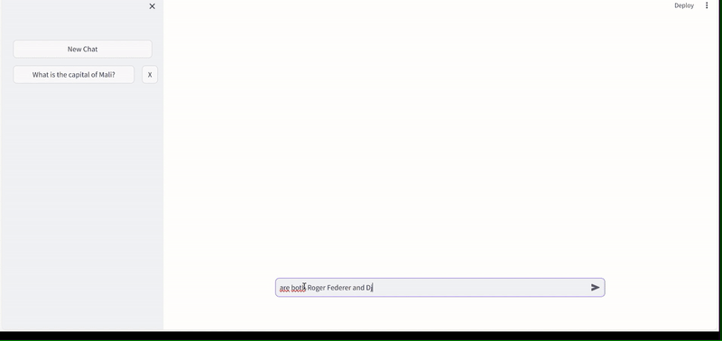

# Ask Metis
Ask Metis is a pay-as-you-go [OpenAI](https://openai.com/) powered chatbot with automatic model routing and per-request cost information. Optimal suited for university students.




### Pay-as-you-go
OpenAI's [ChatGPT plus](https://chat.openai.com/) provides its service via subscription based payment. There are some obvious disadvantages to this approach:  
1. Certainly, there are times (e.g. when studying for exams) where you need the chatbot service more often but also times where you utilize it only sparsly. Adapting the subscription all the time is cumbersome and additionally prevents it from using the services occasionally.
2. In a subscription based payment you implicitly pay for all the services offered, even if you don't use them.

Pay-as-you go solves all these problems as you only pay for what you need the time you need it.

### Automatic Model Routing
A further disadvantage of ChatGPT plus is that by default it utilizes [GPT-4](https://openai.com/gpt-4), even if your request could perfectly be served by [GPT-3.5](https://platform.openai.com/docs/models/gpt-3-5-turbo). This not only introduces unnecessary costs but also contributes negatively to your carbon footprint.  
Ask Metis uses an additional AI layer (without adding latency) provided by [notdiamond.ai](https://www.notdiamond.ai/notdiamond-0001) to figure out the best GPT model instance to serve your request. This model routing in addition to pay-as-you-go results in spending much less money.

### Per-request cost information
We want to make sure that you have your expenses under controll, that is why Ask Metis provides precise information about the cost of each request.


## Install locally
The first thing you need to do is to get a [OpenAI API key](https://openai.com/blog/openai-api) and [NotDiamond API Key](https://www.notdiamond.ai/notdiamond-0001). Then create a `.env` file
```
touch .env
```
Add the following lines to your .env file
```
OPENAI_API_KEY1="your api key"
NOT_DIAMOND_API_KEY="your api key"
```
In a next step create the virtual environment e.g., with conda
```
conda create --prefix .venv/ python==3.9.0
conda activate ~/ask-metis/.venv/
pip install -r requirements.txt
```
**Note:** Change the path accordingly.  
After this step you should be able to 
```
./run_local.sh
```
**Note:** Maybe you have to give the bash script the correct access. You can do this with 
```
chmod +x run_local.sh
```

## Run with Docker (recommended)
You still need to get your API keys and create a `.env` file as described in the previous section. Afterwards you just can run
```
docker build -t chat-metis . 
docker run -p 8002:8002 -v .:/app chat-metis
```
To stop your docker image just type
```
docker ps
docker stop <CONTAINER ID>
```

## TODOS
- Add switch for model usage
- Add support for generate images
- Add support for upload pdfs


